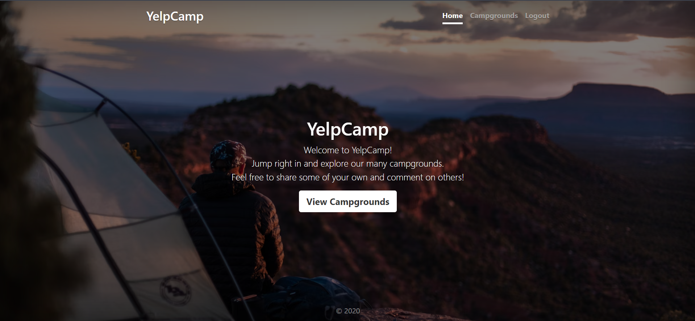
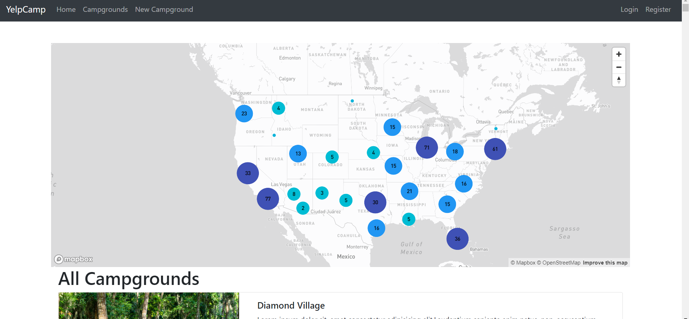
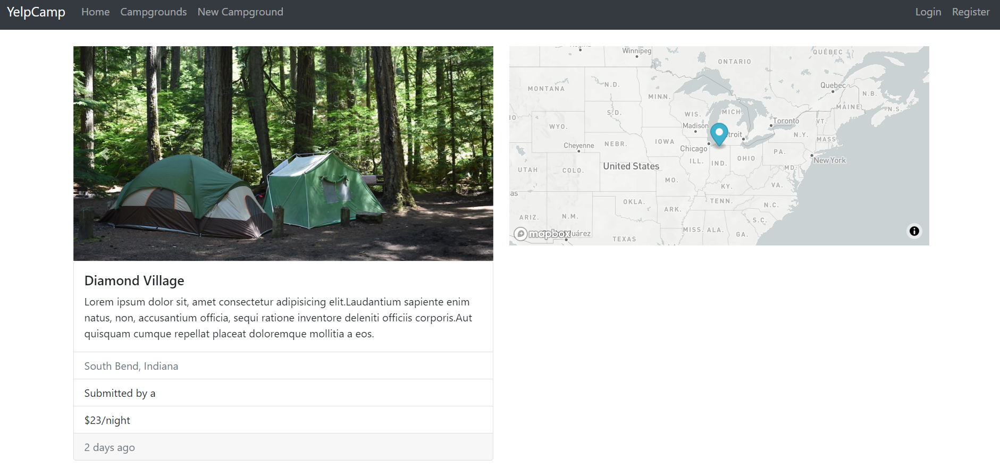
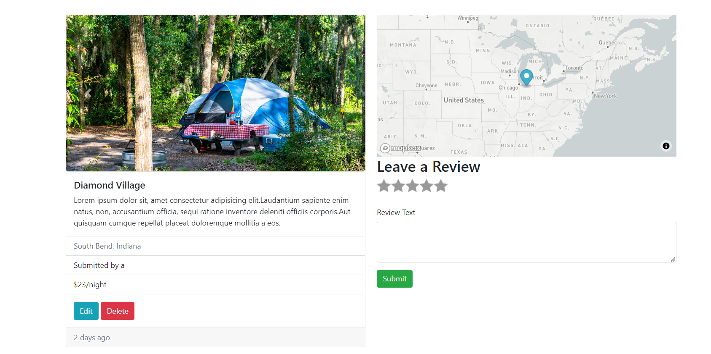

# Express App README
=====================

## Environment Variables
------------------------

### Cloudinary

* `CLOUDINARY_CLOUD_NAME`
* `CLOUDINARY_KEY`
* `CLOUDINARY_SECRET`

### Map Box

* `MAP_BOX_TOKEN`

### Database

* `DB_URL`

### Secret

* `SECRET`

## Screenshots
--------------

### Home Pages


### Campgrounds Page


###  Campground Page without Login


### Campground Page without Login


## Running the Application
---------------------------

### Cloning the Repository 
 ```bash
git clone https://github.com/hemantp88/YELPCAMP.git
```

### Installing Dependencies
```bash
npm install
```


### Setting Environment Variables

Create a `.env` file in the project root directory and add the required environment variables. 

* CLOUDINARY_CLOUD_NAME
* CLOUDINARY_KEY
* CLOUDINARY_SECRET
* MAP_BOX_TOKEN
* DB_URL
* SECRET

### Running the Application
```bash
node app.js
```

The application will start on `http://localhost:3000`. Open your web browser and navigate to this URL to access the application.

**Note**: Make sure to replace the placeholders with your actual values.